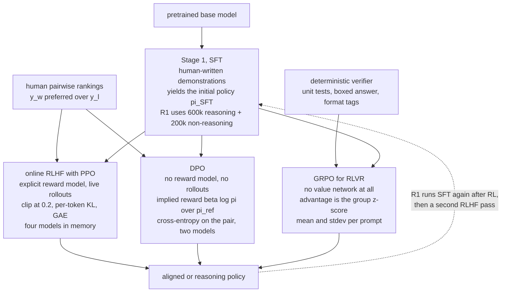

<aside class="kb-header kb-type-concept" aria-label="Page information">

Concept

Reinforcement Learning from Human Feedback (RLHF) is the primary post-training alignment paradigm used to steer large language models toward human preferences.

<a href="/trust">Draft - written, claims not checked against the source</a>

Read first: <a href="/fine-tuning/concepts/instruction-tuning">Instruction Tuning</a>

<nav class="kb-related" aria-label="Related concepts"><ul><li><a href="/fine-tuning/concepts/alignment">AI Alignment</a></li><li><a href="/fine-tuning/concepts/direct-preference-optimization">Direct Preference Optimization</a></li><li><a href="/fine-tuning/concepts/supervised-fine-tuning">Supervised Fine-Tuning</a></li><li><a href="/llm-fundamentals/concepts/thinking-models">Thinking Models</a></li><li><a href="/eval-safety/concepts/hallucination">Hallucination</a></li><li><a href="/eval-safety/concepts/prompt-injection">Prompt Injection</a></li><li><a href="/agents/concepts/reasoning-llms">Reasoning LLMs</a></li><li><a href="/rag/concepts/data-curation">Data Curation for LLMs</a></li><li><a href="/eval-safety/concepts/evaluation">Evaluation</a></li><li><a href="/llm-fundamentals/concepts/synthetic-data">Synthetic Data for Language Models</a></li><li><a href="/fine-tuning/concepts/post-training-lineage">Post-Training Lineage: What Actually Replaced What</a></li></ul></nav>
<nav class="kb-sources" aria-label="Sources cited"><ul><li><a href="/fine-tuning/sources/source-training-language-models-to-follow-instructions-with-human-feedback">Training language models to follow instructions with human feedback</a></li><li><a href="/fine-tuning/sources/source-direct-preference-optimization">Direct Preference Optimization: Your Language Model is Secretly a Reward Model</a></li><li><a href="/llm-fundamentals/sources/source-deep-dive-into-llms-like-chatgpt">Deep Dive into LLMs like ChatGPT</a></li><li><a href="/fine-tuning/sources/source-cs336-lecture15-sft-rlhf">CS336 Lecture 15 — After Pretraining: Mid/Post-training, SFT and RLHF (Tatsu Hashimoto)</a></li><li><a href="/fine-tuning/sources/source-cs336-lecture16-rlvr">CS336 Lecture 16 — Post-training 2: Reinforcement Learning from Verifiable Rewards (Tatsu Hashimoto)</a></li></ul></nav>

<a href="/catalog">All pages</a>

</aside>

## Overview
**Reinforcement Learning from Human Feedback (RLHF)** is the primary post-training alignment paradigm used to steer large language models toward human preferences. First demonstrated systematically at scale in [[source-training-language-models-to-follow-instructions-with-human-feedback]] (InstructGPT), RLHF traditionally trains a separate **Reward Model (RM)** on pairwise human comparisons $(y_w \succ y_l)$ and uses policy gradient algorithms (PPO) or direct mathematical reparameterizations ([[direct-preference-optimization|DPO]]) to maximize reward while penalizing drift from the initial policy. CS336 Lectures 15–16 [[source-cs336-lecture15-sft-rlhf]] [[source-cs336-lecture16-rlvr]] extend this to **RLVR** (verifiable rewards for math/code) and dissect why PPO remains finicky, how DPO drops the reward model, and how GRPO enables the o1/R1 leap by removing the value network.

## Key Ideas
- **The Evaluation-Generation Asymmetry:** It is substantially easier and faster for human annotators to rank which of two model responses is better than to write a flawless demonstration from scratch.
- **The 3-Step InstructGPT Alignment Pipeline:**
  1. **Supervised Fine-Tuning (SFT):** Fine-tune the base model on human demonstration dialogues to create the initial instruction policy $\pi^{\text{SFT}}$.
  2. **Reward Model (RM) Training:** Train a scalar reward predictor $r_\theta(x, y)$ on pairwise human rankings using cross-entropy loss:
     $$\text{loss}(\theta) = -\frac{1}{\binom{K}{2}} \mathbb{E}_{(x, y_w, y_l) \sim D} \left[ \log \sigma\left(r_\theta(x, y_w) - r_\theta(x, y_l)\right) \right]$$
     where $y_w$ is preferred over $y_l$.
  3. **Reinforcement Learning with PPO-ptx:** Fine-tune $\pi_\phi^{\text{RL}}$ to maximize scalar rewards with a per-token KL divergence penalty and pretraining gradient mixing:
     $$\text{obj}(\phi) = \mathbb{E}_{(x, y) \sim D_{\pi_\phi^{\text{RL}}}} \left[ r_\theta(x, y) - \beta D_{\text{KL}}\left(\pi_\phi^{\text{RL}}(y|x) \,\|\, \pi^{\text{SFT}}(y|x)\right) \right] + \gamma \mathbb{E}_{x \sim D_{\text{pretrain}}} \left[ \log \pi_\phi^{\text{RL}}(x) \right]$$
- **Imitation vs Optimization — the G-V Gap:** SFT fits `p(y|x)≈p*(y|x)` (generative view); RLHF maximizes `E_p[R(y,x)]` (policy view). Zhang 2023 summarization shows humans prefer better summaries than they write — motivation for moving from imitation to optimization [[source-cs336-lecture15-sft-rlhf]].
- **Online RL (PPO) vs. Offline Alignment ([[direct-preference-optimization|DPO]]) vs. GRPO (RLVR):**
  - *Online RLHF (PPO):* Policy generates dynamic rollouts during training, evaluated by the Reward Model. Highly capable but computationally intensive (requires 4 models in memory). PPO chain: policy gradients (high variance) → TRPO linearization → PPO clipped ratios (`ε=0.2`); LM idealized as token-bandit with dense final reward (Zheng 2023); AlpacaFarm `ppo_trainer.py` outer rollouts + inner PPO epochs, per-token KL + last-token reward, GAE `γ=λ=1` as reward-to-go [[source-cs336-lecture16-rlvr]].
  - *Direct Preference Optimization (DPO):* Solves the exact same objective in closed form by reparameterizing the reward as $r(x,y) = \beta \log \frac{\pi_\theta(y|x)}{\pi_{\text{ref}}(y|x)}$, converting RL into stable binary cross-entropy. CS336 derivation: nonparametric `π*` → implied reward `r=β log π/π_ref + β log Z`, `Z` cancels under Bradley-Terry → `ℒ_DPO = -log σ(β log π(y_w)/π_ref - β log π(y_l)/π_ref)` = pos-grad on good, neg-grad on bad scaled by implied-reward error [[source-cs336-lecture15-sft-rlhf]].
  - *GRPO (Group Relative Policy Optimization):* PPO without value model — advantage as group z-score `(r-mean)/std` with 1e-4 stabilizer; same as group-normalized policy gradient online; enables tiny `nano-aha-moment` impl. Fixups: stdev not a valid baseline (Liu 2025 unbiased → leave-one-out), length normalization trade-offs; basis for DeepSeek-R1/Kimi/Qwen 3 RLVR [[source-cs336-lecture16-rlvr]].
- **RLVR (Verifiable Rewards):** In domains with deterministic ground truth (coding unit tests, math `is_equivalent` boxed answer, format `⟨think⟩` tags), automated verifiers replace noisy human preference models, enabling clean scaling to o1/R1 without MCTS/PRMs (which DeepSeek ablated and rejected). Accuracy + format rewards suffice for R1-Zero; full R1 adds language-consistency reward [[source-cs336-lecture16-rlvr]].
- **Data Reality — Who Labels and How:** Pairwise data from InstructGPT guidelines / Bard annotations → modern Outlier/ScaleAI distribution with compensation variance and expert-annotation growth; difficulties: verifying correctness, AI-use contamination, demographic shift (Santurkar 2023), annotator style heterogeneity (Hosking 2024) where some annotators matter a lot. LM-generated feedback (GPT-4) reaches near-human inter-annotator agreement and system-level rank `ρ≈1` (RLEF/UltraFeedback in Zephyr/Olmo/Tulu 3), but length effects (Chen/Singhal 2024) and style biases persist; Constitutional AI self-training as alternative [[source-cs336-lecture15-sft-rlhf]].
- **Side-Effects — Overoptimization & Mode Collapse:** Optimizing RM beyond threshold degrades true preference (curves diverge for human vs noisy LM vs noiseless LM pref); RLHF also reduces entropy/calibration — model is no longer a calibrated probabilistic model. Length effects are a major RLHF artifact [[source-cs336-lecture15-sft-rlhf]] [[source-cs336-lecture16-rlvr]].

## How It Works

SFT is the trunk and the three RL variants are branches off it, not successive generations.
What distinguishes them is drawn on the left: **where the training signal comes from**. PPO
and DPO both consume the same human rankings and differ only in whether those rankings are
compiled into a reward model; GRPO replaces the human entirely with a program.

The dotted edge is the part the linear telling of this story gets wrong. DeepSeek-R1's actual
order is SFT → GRPO → SFT → RLHF: the supervised stage is revisited *after* reinforcement
learning, to fold RL-discovered reasoning behaviour back into a well-behaved assistant. Kimi
and Qwen 3 do the same shape. See [[post-training-lineage]] for why that makes the stages a
composition rather than a succession.

## Practical Implications
- **Alignment Beats Parameter Scale:** A 1.3B parameter aligned InstructGPT model is preferred by human evaluators over a 175B base GPT-3 model (100x parameter reduction).
- **Substantial Hallucination Reduction:** Factual [[hallucination]] in closed-domain tasks dropped from 41% to 21% following RLHF alignment.
- **Data Budget for Safety Is Tiny but Demographics Matter:** 500 Alpaca-style safety examples (Anthropic HH) → large safety gain; but annotator pool skews behavior (Santurkar) — log who labels [[source-cs336-lecture15-sft-rlhf]].
- **Length Is a Leaked Reward:** Both human and GPT-4 judges strongly prefer longer responses (Dubois) — RLHF amplifies it; length-controlled win-rate (AlpacaEval LC) and explicit length penalties (Kimi `λ∈[-0.5,0.5]`) are needed [[source-cs336-lecture15-sft-rlhf]] [[source-cs336-lecture16-rlvr]].
- **Choose Your RL Variant by Constraint:** Need online rollouts + value? PPO (strong but finicky, 4 models). Need offline stable? DPO (2 models, Bradley-Terry). Need verifiable scaling to reasoning? GRPO (no critic, group-normed; watch stdev/length bias) — as used in R1/Kimi/Qwen 3 [[source-cs336-lecture16-rlvr]].
- **Plan for Post-RLVR Ordering:** DeepSeek R1 pattern is reasoning GRPO → reason+non-reason SFT → second RLHF; Qwen 3 shows general RLHF slightly hurts STEM — keep reasoning and general stages separate.

## Connections
- Implements core [[alignment]] principles (Helpful, Honest, Harmless).
- Builds directly upon [[supervised-fine-tuning]].
- Solved without RL sampling via [[direct-preference-optimization]].
- Underpins verifiable self-play in [[thinking-models]].

## Open Questions
- What are the scaling limits of DPO versus iterative Online RL with live reward modeling? Kimi's squared-loss DPO² and Qwen 3's 3995-example GRPO suggest online verifiable RL scales differently than offline preference DPO.
- How to eliminate reward hacking when aligning on subjective, nuanced creative writing? RLVR avoids it via verifiability, but overoptimization curves (human vs noisy LM) show noisy RMs Goodhart quickly [[source-cs336-lecture16-rlvr]].
- GRPO bias question: does Liu 2025 unbiased + length-norm fix fully remove stdev upweighting of hard/easy groups without hurting exploration? [[source-cs336-lecture16-rlvr]]
- Can SFT cold-start be minimized (R1-Zero shows pure RL works) while preserving interpretability and language consistency? 1K vs 600K trace trade-off remains [[source-cs336-lecture16-rlvr]].

## Sources
- [[source-training-language-models-to-follow-instructions-with-human-feedback]]
- [[source-direct-preference-optimization]]
- [[source-deep-dive-into-llms-like-chatgpt]]
- [[source-cs336-lecture15-sft-rlhf]]
- [[source-cs336-lecture16-rlvr]]

## Synthesis

- [[post-training-lineage]] — why the SFT → RLHF → DPO → RLVR story is a composition rather than a succession

<nav class="kb-next" aria-label="Next in this reading path">
Next in this reading path: <a href="/fine-tuning/concepts/direct-preference-optimization">Direct Preference Optimization</a>
</nav>

---

Original analysis, CC BY-SA 4.0. See NOTICE for source attributions.

**Status:** `draft` — Written but not fully checked against the cited source. See [[trust]] for methodology.
