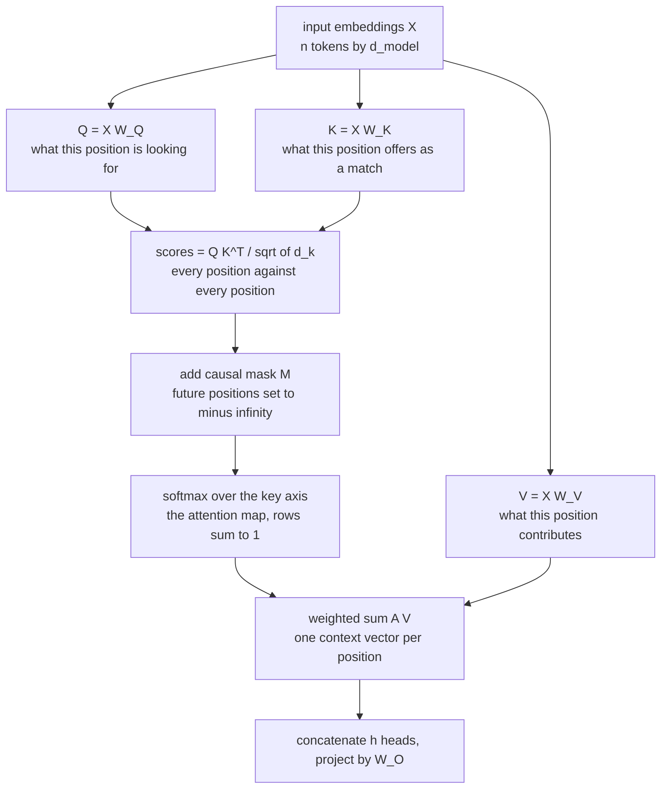

<aside class="kb-header kb-type-concept" aria-label="Page information">

Concept

Self-Attention (intra-attention) is the core computational primitive of the Transformer architecture.

<a href="/trust">Draft - written, claims not checked against the source</a>

Read first: <a href="/llm-fundamentals/concepts/rnn">Recurrent Neural Network</a>

<nav class="kb-related" aria-label="Related concepts"><ul><li><a href="/llm-fundamentals/concepts/transformer">Transformer</a></li><li><a href="/llm-fundamentals/concepts/positional-encoding">Positional Encoding</a></li><li><a href="/inference/concepts/inference">LLM Inference</a></li></ul></nav>
<nav class="kb-sources" aria-label="Sources cited"><ul><li><a href="/llm-fundamentals/sources/source-attention-is-all-you-need">Attention Is All You Need</a></li><li><a href="/llm-fundamentals/sources/source-transformer-explainer">Transformer Explainer: Learning LLM Transformers with Interactive Visual Explanation and Experimentation</a></li><li><a href="/llm-fundamentals/sources/source-deep-dive-into-llms-like-chatgpt">Deep Dive into LLMs like ChatGPT</a></li></ul></nav>

<a href="/catalog">All pages</a>

</aside>

## Overview
**Self-Attention** (intra-attention) is the core computational primitive of the [[transformer]] architecture. Introduced by [[google-research]] in [[source-attention-is-all-you-need]] and visually dissected in [[source-transformer-explainer]], it enables each token in a sequence to dynamically attend to and aggregate information from all other tokens in $O(1)$ sequential operations, eliminating the $O(N)$ sequential path dependency of RNNs.

## Key Ideas
- **Query, Key, Value Projections:** Every token embedding vector $x_i$ is linearly projected into three distinct vector representations:
  - **Query ($Q = XW_Q$):** What the current token is looking for.
  - **Key ($K = XW_K$):** What information the current token contains to match queries.
  - **Value ($V = XW_V$):** The actual content information to be aggregated.
- **Scaled Dot-Product Attention:**
  $$\text{Attention}(Q, K, V) = \text{softmax}\left(\frac{QK^T}{\sqrt{d_k}} + M\right)V$$
  where $\sqrt{d_k}$ prevents dot products from growing excessively large in high dimensions (which would push softmax gradients into regions with vanishingly small gradients), and $M$ is the causal mask.
- **Multi-Head Attention (MHA):**
  Instead of performing a single attention function, MHA projects queries, keys, and values $h$ times with different learned parameter matrices:
  $$\text{MultiHead}(Q, K, V) = \text{Concat}(\text{head}_1, \dots, \text{head}_h)W^O$$
  where $\text{head}_i = \text{Attention}(QW_i^Q, KW_i^K, VW_i^V)$. This allows the model to jointly attend to information from different representation subspaces (e.g., syntax, coreference, factual relations).
- **Causal Masking:** In decoder-only models, an upper-triangular mask of $-\infty$ is added before the softmax operation to ensure position $i$ cannot attend to future positions $j > i$.

## How It Works

The shape of the computation is the point: **Q and K meet to decide *where* to look, and V
bypasses that entirely to supply *what* is read**. Three projections of the same input play
different roles, and the mask is inserted before the softmax rather than after, so the
normalisation itself never sees the future.

Two things the equation hides. The mask is *added*, not applied afterwards, which is why
$-\infty$ rather than zero: it has to survive the exponential. And $V$ never touches the
score path, which is what makes attention a **soft lookup** rather than a similarity
measure — the weights come from one pair of projections, the content from a third.

### What the mask actually looks like

The causal mask $M$ is usually described as "upper-triangular $-\infty$", which is accurate
and tells you nothing about what it does to a sentence. Drawn as a matrix it does:

The consequence worth noticing is the first row. Position 1 has exactly one readable cell —
itself — so after normalisation its attention weight is $1.0$ no matter what the model
learned. The first token of a sequence cannot attend to anything, which is part of why
attention-sink and BOS-token effects show up at position 0 in practice.

## Practical Implications
- **Maximum Path Length $O(1)$:** Enables massive parallelization during pretraining compared to sequential recurrence ($O(N)$).
- **Quadratic Complexity:** Attention computation scales quadratically $O(N^2)$ with sequence length $N$, motivating linear attention approximations, FlashAttention kernel fusions, and multi-query / grouped-query optimizations.
- **Serving Optimization:** Optimized during autoregressive decoding via KV caching in [[inference]].

## Connections
- Foundational component of the [[transformer]].
- Relies on [[positional-encoding]] to restore sequential order information.
- Interactive token-level dynamics visualizable in [[source-transformer-explainer]].
- Execution memory bottleneck mitigated via KV caching in [[inference]].

## Sources
- [[source-attention-is-all-you-need]]
- [[source-transformer-explainer]]
- [[source-deep-dive-into-llms-like-chatgpt]]

<nav class="kb-next" aria-label="Next in this reading path">
Next in this reading path: <a href="/llm-fundamentals/concepts/positional-encoding">Positional Encoding</a>
</nav>

---

Original analysis, CC BY-SA 4.0. See NOTICE for source attributions.

**Status:** `draft` — Written but not fully checked against the cited source. See [[trust]] for methodology.
